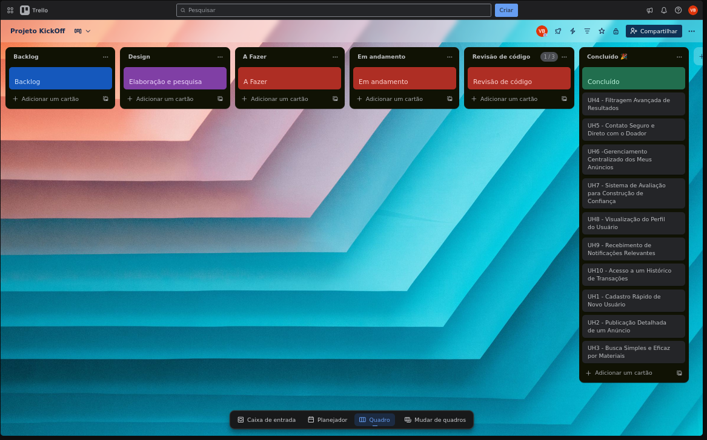

# kickOff

<h2>Sumário</h2>
<a href="#papeis">Papéis dos integrantes</a>  
<a href="#backlog">Backlog (Trello)</a>

<h2 id="papeis">Papéis dos integrantes</h2>
[Vinicius Gabriel](https://github.com/gitviini/) Scrum Master  
[Juliana Comparoto](https://github.com/comparoto) Designer  
[Matheus de Freitas](https://github.com/matheusprojects) Designer  
[Marcos Fraga](https://github.com/MarcTony0) Desenvolvedor Back-end  
[Iza](https://github.com/) Desenvolvedor Back-end  
[Joanna Farias](https://github.com/Joanna-Farias) Desenvolvedor Front-end  
[Malu](https://github.com/alumiria) Desenvolvedor Front-end  

<h2 id="backlog">Backlog (Trello)</h2>
